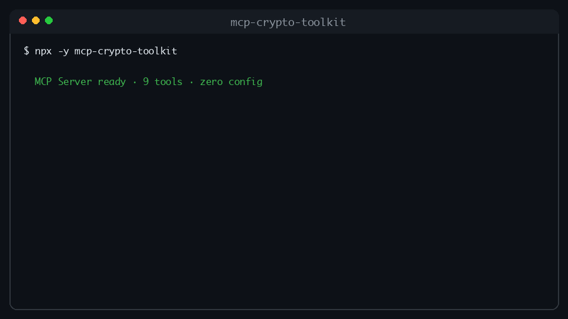

# mcp-crypto-price

[](https://www.npmjs.com/package/mcp-crypto-price)
[](https://opensource.org/licenses/MIT)
[](https://modelcontextprotocol.io)

**Live crypto prices, PKR conversion, gas tracker, and calculators for AI agents.**

Ask Claude: *What's 0.5 BTC in PKR? What's ETH gas now?*



## Features

- Live cryptocurrency prices via CoinGecko (100+ coins)
- PKR conversion with Binance P2P rates (fallback to CoinGecko)
- EVM gas tracker for Ethereum, BNB, Polygon, Arbitrum, and Base
- Profit/loss calculator with fees and break-even
- Historical price lookup with $1,000 investment comparison

## Quick Install

```bash
npx -y mcp-crypto-price
```

Zero config. No API keys required for basic usage.

## Installation

### Claude Desktop

Add to `claude_desktop_config.json`:

```json
{
  "mcpServers": {
    "crypto-price": {
      "command": "npx",
      "args": ["-y", "mcp-crypto-price"]
    }
  }
}
```

Or use a local build:

```json
{
  "mcpServers": {
    "crypto-price": {
      "command": "node",
      "args": ["/ABSOLUTE/PATH/TO/mcp-crypto-price/dist/index.js"]
    }
  }
}
```

### Cursor

Add to `.cursor/mcp.json`:

```json
{
  "mcpServers": {
    "crypto-price": {
      "command": "npx",
      "args": ["-y", "mcp-crypto-price"]
    }
  }
}
```

### Windsurf

Add to your MCP configuration:

```json
{
  "mcpServers": {
    "crypto-price": {
      "command": "npx",
      "args": ["-y", "mcp-crypto-price"]
    }
  }
}
```

## Tools

| Tool | Description |
|------|-------------|
| `get_price` | Live price of any crypto in any fiat (including PKR) |
| `convert` | Convert between crypto and fiat with optimized PKR support |
| `gas_tracker` | Live gas fees for EVM chains |
| `profit_calc` | Calculate profit/loss, ROI, and break-even |
| `historical_price` | Historical price on a specific date (DD-MM-YYYY) |

## Example Prompts

1. *What's the current price of Bitcoin in PKR?*
2. *Convert 0.5 ETH to USD*
3. *What are Ethereum gas fees right now?*
4. *I bought 0.5 BTC at $60,000 and sold at $70,000 — what's my profit?*
5. *What was the price of Solana on 01-01-2024 and what would $1000 invested then be worth now?*

## Development

```bash
git clone https://github.com/YOUR_USERNAME/mcp-crypto-price
cd mcp-crypto-price
npm install
npm run build
npm run inspector   # Test with MCP Inspector
```

### Optional API Keys

For more reliable gas tracking, set these environment variables:

- `ETHERSCAN_API_KEY` — Ethereum gas oracle
- `BSCSCAN_API_KEY` — BNB Chain gas oracle
- `POLYGONSCAN_API_KEY` — Polygon gas oracle
- `ARBISCAN_API_KEY` — Arbitrum gas oracle
- `BASESCAN_API_KEY` — Base gas oracle

Without API keys, gas data falls back to Blocknative and static estimates.

## API Credits

- [CoinGecko](https://www.coingecko.com/) — Price data (free tier, no key required)
- [Binance P2P](https://p2p.binance.com/) — USDT/PKR rates
- [Etherscan](https://etherscan.io/) / [BscScan](https://bscscan.com/) — Gas oracles (optional API keys)
- [Blocknative](https://www.blocknative.com/) — Gas price fallback

## License

MIT — see [LICENSE](./LICENSE)
